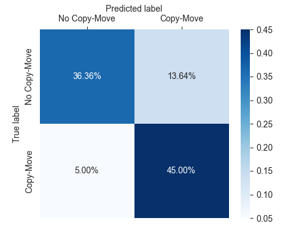

# CMFD

Copy-Move Forgery Detection and Localization
*This is a course project for media information security*

## Introduction

Copy-Move Forgery Detection (CMFD) is a technique to detect and localize copy-move forgery in images. The goal of this project is to implement multiple CMFD algorithms in python and evaluate the performance.

## Group Member

+ [Haotian Hong](https://github.com/bughht)
+ [Zhenyu Jin](https://github.com/getOcr)

## Phylosophy

*Talk is cheap, show me the code.*

## Dataset

[MICC-F220](http://lci.micc.unifi.it/labd/cmfd/MICC-F220.zip): this dataset is composed by 220 images; 110 are tampered and 110 originals.

## Baseline

The baseline is a sift-based algorithm implemented in Python. With current parameters, the evaluation result of this algorithm on MICC-F220 is shown below.

|              | precision | recall | f1-score | support |
| -----------: | :-------- | :----- | :------- | :------ |
| No Copy-Move | 0.88      | 0.73   | 0.80     | 110     |
|    Copy-Move | 0.77      | 0.90   | 0.83     | 110     |

+ Accuracy: 81.36%
+ Confusion-Matrix: 

## Pre-requisites

'''python
pip install -r Requirements.txt
'''

## Project Goals Checkbox

+ [x] Implement block-based algorithm (*it sucks because of its O(n^4) time complexity*)
+ [ ] Implement feature-point-based algorithm.
  + [x] SIFT feature
  + [ ] FAST feature
  + [ ] ORB feature
+ [ ] Implement matching algorithms
  + [x] Brute-force matching
  + [x] Fann matching
  + [ ] Hu moments matching
+ [x] Design a model performance evaluation framework
  + [x] Torch Dataset and DataLoader wrapper
  + [x] Model performance evaluation

## Contribution

We are welcome to any contribution to this project. If you are interested in this project, please contact us.

## References

+ Amerini, I., Ballan, L., Caldelli, R., Del Bimbo, A., & Serra, G. (2011). A sift-based forensic method for copy–move attack detection and transformation recovery. IEEE transactions on information forensics and security, 6(3), 1099-1110.

+ Feature detection and description. OpenCV. (n.d.). Retrieved January 1, 2023, from https://docs.opencv.org/4.x/db/d27/tutorial_py_table_of_contents_feature2d.html 

+ Christlein, V., Riess, C., Jordan, J., Riess, C., & Angelopoulou, E. (2012). An evaluation of popular copy-move forgery detection approaches. IEEE Transactions on information forensics and security, 7(6), 1841-1854.

+ Geng, L. C., Jodoin, P. M., Su, S. Z., & Li, S. Z. (2016). CBDF: compressed binary discriminative feature. Neurocomputing, 184, 43-54.

+ Raju, P. M., & Nair, M. S. (2022). Copy-move forgery detection using binary discriminant features. Journal of King Saud University-Computer and Information Sciences, 34(2), 165-178.
