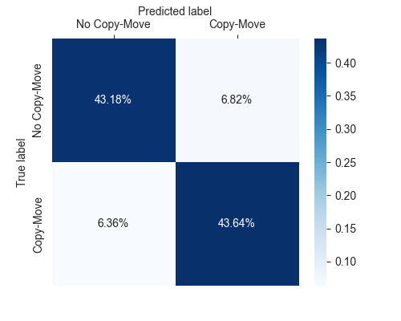
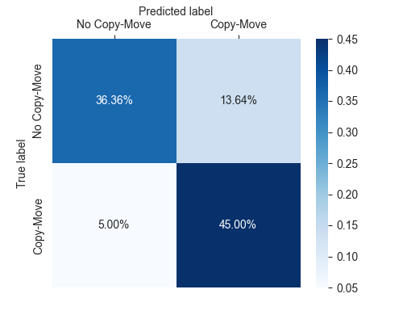
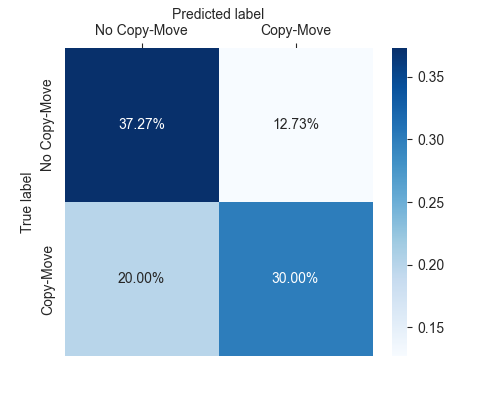

# CMFD

Copy-Move Forgery Detection and Localization
*This is a course project for media information security*

## Introduction

Copy-Move Forgery Detection (CMFD) is a technique to detect and localize copy-move forgery in images. The goal of this project is to implement multiple CMFD algorithms in python and evaluate the performance.

We design a framework to evaluate the performance of the algorithm. The framework is based on PyTorch and can be easily extended to other algorithms.

Besides, we also implement a baseline algorithm (SIFT) and enhance it with patched self-adaptive methods to improve the performance.

## Group Info

+ [Haotian Hong](https://github.com/bughht)
+ [Zhenyu Jin](https://github.com/getOcr)

Phenomenon: *Talk is cheap, show me the code.*

## Dataset

[MICC-F220](http://lci.micc.unifi.it/labd/cmfd/MICC-F220.zip): this dataset is composed by 220 images; 110 are tampered and 110 originals.

## Pre-requisites

+ python>=3.7
+ opencv-python
+ numpy
+ sklearn
+ torch
+ pandas

## Installation

```bash
git clone https://github.com/bughht/CMFD.git
cd CMFD
wget http://lci.micc.unifi.it/labd/cmfd/MICC-F220.zip
unzip MICC-F220.zip
pip install -r Requirements.txt
```

## Usage

### Run the baseline

```bash
python AlgoTest.py -a SIFT_Methods
```

### Design your own algorithm

Make sure your algorithm is written in the format below:

Filename: `MyAlgorithm.py`

```python
class MyAlgorithm:
    def __init__(self, **kwargs):
        # initialize your algorithm

    def predict(self, img):
        # detect copy-move forgery in the image
        # return the classification result (0 or 1)
```

Then run the following command:

```bash
python AlgoTest.py -a MyAlgorithm
```

or

```bash
python AlgoTest.py --algorithm MyAlgorithm
```


## Baseline: SIFT

The baseline is a sift-based algorithm implemented in Python. With current parameters, the evaluation of this algorithm on MICC-F220 is shown below.

**Accuracy:** 81.36%
**Precision:** 76.74%
**Recall:** 90.00%
**F1 Score:** 82.85%

## Enhancement: Patch-SIFT

+ **Principle**: Split images into patches and adapt the parameters of SIFT (sigma) to the smoothness of the patch.
+ **Algorithm**:
  + Split the image into patches
  + For each patch, calculate the smoothness of the patch (using the variance of the Laplacian)
  + For each patch, adapt the parameters of SIFT (sigma) to the smoothness of the patch (using linear model) and apply SIFT to the patch
  + Apply Brute-Force Matching to the image
  + Evaluate the performance of the algorithm

**Accuracy:** 86.82%
**Precision:** 86.49%
**Recall:** 87.27%
**F1 Score:** 86.88%

## Experiment Results

We've tested the following algorithms on MICC-F220 dataset based on our framework:

+ Patch-SIFT
+ SIFT
+ ORB

## Patch-SIFT

| Patch-SIFT   | precision | recall | f1-score | support |
| ------------ | :-------- | :----- | :------- | :------ |
| No Copy-Move | 0.87      | 0.86   | 0.87     | 110     |
| Copy-Move    | 0.86      | 0.87   | 0.87     | 110     |

+ Accuracy:86.82% Precision:86.49% Recall:87.27%
+ Confusion Matrix



### SIFT

| SIFT         | precision | recall | f1-score | support |
| ------------ | :-------- | :----- | :------- | :------ |
| No Copy-Move | 0.88      | 0.73   | 0.80     | 110     |
| Copy-Move    | 0.77      | 0.90   | 0.83     | 110     |

+ Accuracy:81.36% Precision:76.74% Recall:90.00% F1 Score:82.85%
+ Confusion-Matrix:




### ORB

| ORB          | precision | recall | f1-score | support |
| ------------ | :-------- | :----- | :------- | :------ |
| No Copy-Move | 0.65      | 0.75   | 0.69     | 110     |
| Copy-Move    | 0.70      | 0.60   | 0.65     | 110     |

+ Accuracy:67.27% Precision:70.21% Recall:60.00% F1 Score:64.71%
+ Confusion-Matrix:




## Project Goals Checkbox

+ [x] Implement feature-point-based algorithms
  + [x] Key Points Extraction
    + [x] SIFT
    + [x] ORB
    + [x] FAST
    + [x] Harris Corner
  + [x] Feature Descriptor
    + [x] SIFT feature
    + [x] ORB feature
+ [x] Implement matching algorithms
  + [x] Brute-force matching
  + [x] Fann matching
+ [x] Design a model performance evaluation framework
  + [x] Torch Dataset and DataLoader wrapper
  + [x] Model performance evaluation
+ [x] Enhance one of the algorithm tested above

## Contribution

We are welcome to any contribution to this project. If you are interested in this project, please contact us.

## References

+ Amerini, I., Ballan, L., Caldelli, R., Del Bimbo, A., & Serra, G. (2011). A sift-based forensic method for copy–move attack detection and transformation recovery. IEEE transactions on information forensics and security, 6(3), 1099-1110.

+ Feature detection and description. OpenCV. (n.d.). Retrieved January 1, 2023, from https://docs.opencv.org/4.x/db/d27/tutorial_py_table_of_contents_feature2d.html 

+ Christlein, V., Riess, C., Jordan, J., Riess, C., & Angelopoulou, E. (2012). An evaluation of popular copy-move forgery detection approaches. IEEE Transactions on information forensics and security, 7(6), 1841-1854.

+ Geng, L. C., Jodoin, P. M., Su, S. Z., & Li, S. Z. (2016). CBDF: compressed binary discriminative feature. Neurocomputing, 184, 43-54.

+ Raju, P. M., & Nair, M. S. (2022). Copy-move forgery detection using binary discriminant features. Journal of King Saud University-Computer and Information Sciences, 34(2), 165-178.
